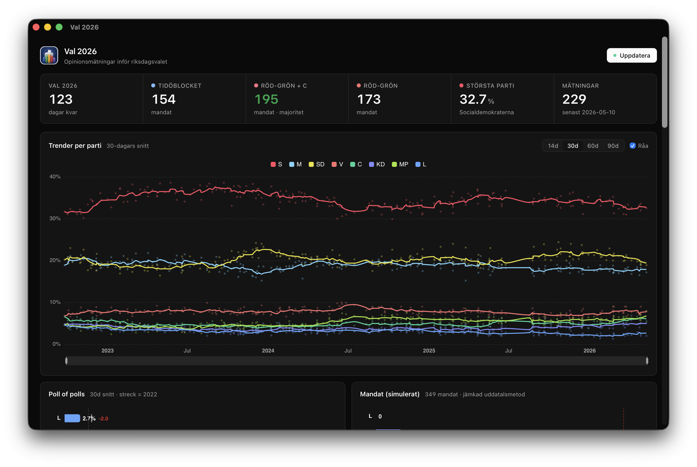

# Val 2026



Desktop-app för att följa opinionsmätningarna inför det svenska riksdagsvalet 2026.

## Funktioner

- Hämtar **alla mätningar från åtta institut** (Verian, Novus, Ipsos, Indikator, Demoskop, SCB, Sentio, Skop) från Wikipedia
- **Trendlinjer** per parti med valbart 14/30/60/90-dagars glidande snitt och råa mätpunkter
- **Poll of polls** med deltaindikator vs valet 2022 och markörer för 2022-resultatet
- **Mandatfördelning** med jämkad uddatalsmetod (349 mandat, 4 % spärr)
- **Riksdagshalvmånen** — interaktiv parlamentsgrafik med 349 prickar i politisk vänster→höger-ordning
- **Koalitionsbyggare** — klicka in/ut partier och se direkt om koalitionen når 175 mandat
- **Blockstöd över tid** för Tidöblocket, Rödgröna och Rödgröna+C
- **Spärrriskindikator** med sparklines för partier nära 4 %-spärren
- **Förändring sedan 2022** rankad efter största vinst→största förlust
- Lokalt SQLite-lager — fungerar offline efter första hämtningen

## Installation

### macOS: "Val 2026 is damaged and can't be opened"

macOS blockerar appar som inte är signerade med ett Apple Developer-certifikat. Kör följande kommando i terminalen för att kringgå detta:


```bash
xattr -cr /Applications/Val\ 2026.app
```


### Windows: "Windows protected your PC"

Windows SmartScreen blockerar installeraren eftersom den saknar en betald code-signing-certifikat. Så här kringgår du:

1. Dubbelklicka på `Val 2026_x.y.z_x64-setup.exe`
2. När varningen "Windows protected your PC" dyker upp, klicka på **More info**
3. Klicka på **Run anyway**

Alternativt via PowerShell (kör som administratör i mappen där installeraren ligger):


```powershell
Unblock-File -Path ".\Val 2026_*_x64-setup.exe"
```


## Utveckling


```bash
npm install
npm run tauri dev
```


## Bygg


```bash
npm run tauri build
```


### Ny version + release


```bash
npm run new:version 1.2.3
```


Uppdaterar versionsnummer i alla filer, skapar en git-tagg och pushar. GitHub Actions bygger då automatiskt DMG (macOS) och EXE (Windows) och skapar en release.

## Stack

- [Tauri 2](https://tauri.app/) — native shell, Rust-backend, SQLite-lagring
- [Vue 3](https://vuejs.org/) + [vue-echarts](https://vue-echarts.dev/) — UI och diagram
- [scraper](https://crates.io/crates/scraper) + [reqwest](https://crates.io/crates/reqwest) — Wikipedia-parser
- Datakälla: [Wikipedia — Opinionsmätningar inför riksdagsvalet i Sverige 2026](https://sv.wikipedia.org/wiki/Opinionsm%C3%A4tningar_inf%C3%B6r_riksdagsvalet_i_Sverige_2026)
